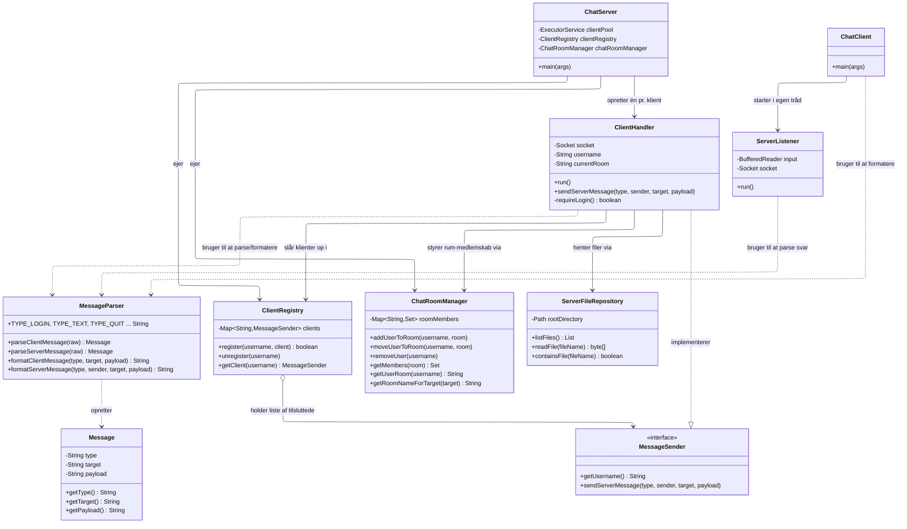
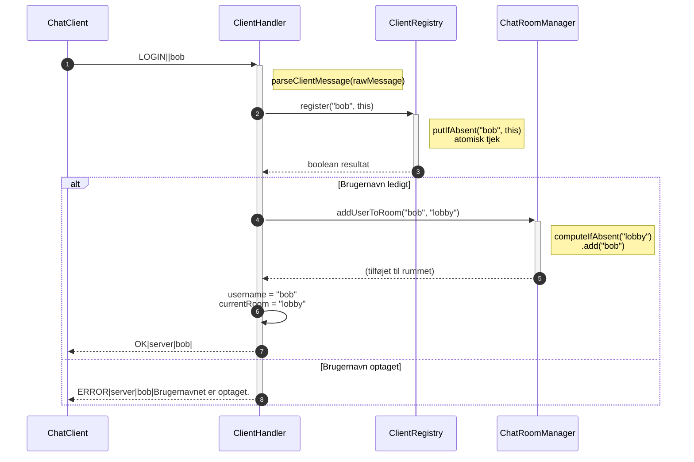
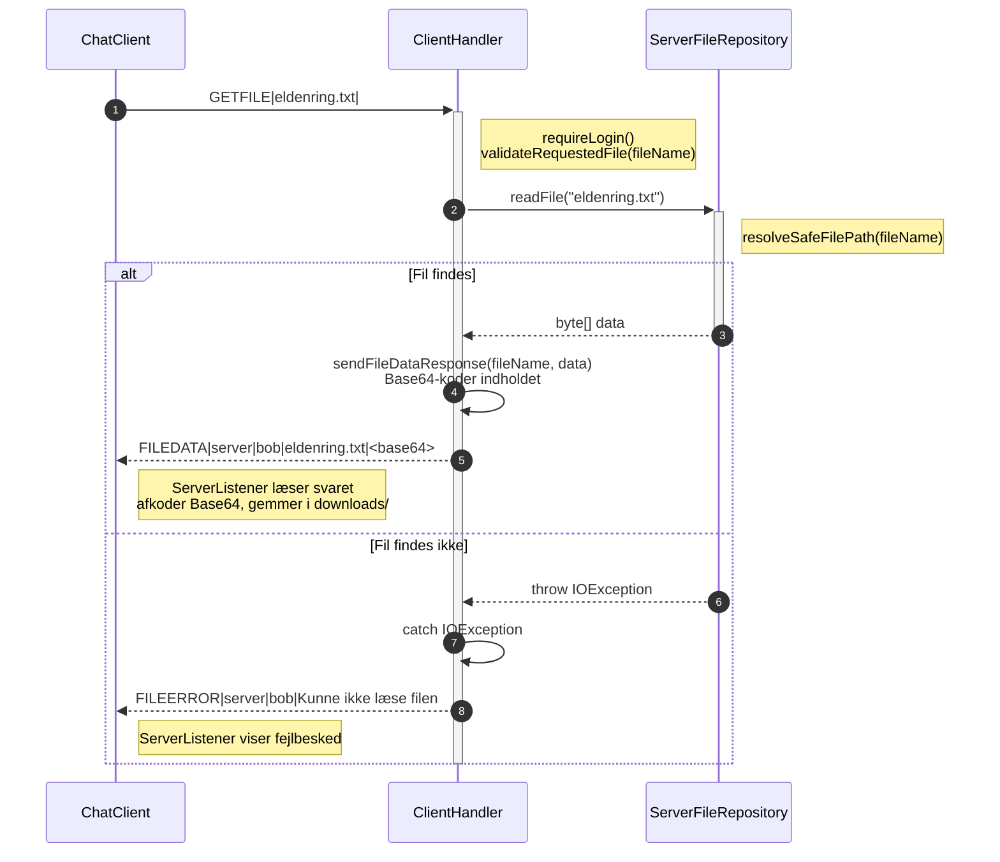

# Chat-miniprojekt

## Gruppe

Gruppe 4, Hello World
Navne: Nicki, Goncalo, Mattias

## Sådan starter du server og klient

Via terminal:
```bash
mvn clean compile
java -cp target/classes server.ChatServer
java -cp target/classes client.ChatClient
```

Bemærk, danske tegn (æ, ø, å) kan vises forkert i nogle Windows-terminaler (fx PowerShell). Kør i stedet programmet via din IDE's Run-knap (fx IntelliJ) for korrekt visning, IDE'en sætter selv de nødvendige encoding-flag.

Når klienten starter, vises den korte hjælp:

```text
Kommandoer: /w <bruger> <besked>, /join <rum>, /list, /get <filnavn>, /quit, /help. Skriv bare almindelig tekst for at chatte i dit nuværende rum.
```

### Kommandotolkning i klienten

Den primære, dokumenterede måde at sende kommandoer på er via slash-kommander:

```text
/w alice Hej Alice
/whisper alice Hej Alice
/join room42
/quit
```

De oversættes til protokollen:

```text
PRIVATE|alice|Hej Alice
JOIN_ROOM|room42|
QUIT||
```

Der er stadig støtte for den rå protokolform direkte som fallback, men slash-kommanderne er den anbefalede måde at bruge klienten på.

## Protokollen

Klient til server, tekstlinjer adskilt med `|`:

```
TYPE|TARGET|PAYLOAD
```

Eksempler:
```
LOGIN||bob
JOIN_ROOM|room42|
TEXT|room42|Hej alle
PRIVATE|alice|Hej Alice
QUIT||
```

Server til klient:

```
TIMESTAMP|TYPE|SENDER|TARGET|PAYLOAD
```

Eksempler:
```
2026-09-25 12:00:00|TEXT|bob|room42|Hej alle
2026-09-25 12:01:00|PRIVATE|alice|bob|Hej Bob
2026-09-25 12:02:00|ERROR|server|bob|Brugernavnet er optaget
```

Filoverførsel tilføjer fire nye beskedtyper:

Klient til server:
```
LISTFILES||
GETFILE|eldenring.txt|
```

Server til klient:
```
2026-09-25 12:03:00|FILELIST|server|bob|eldenring.txt,readme.md
2026-09-25 12:04:00|FILEDATA|server|bob|eldenring.txt|SGVqIGZyYSBzZXJ2ZXJlbg==
2026-09-25 12:05:00|FILEERROR|server|bob|Filen findes ikke
```

FILEDATA's payload er selv opdelt i to dele adskilt af en ekstra pipe, filnavn og Base64-kodet indhold.
 
---

## Klassediagram



**Relationstyper brugt i diagrammet:**

- `..|>` (stiplet pil med trekant), **realisering/implementering**, `ClientHandler` implementerer `MessageSender`-interfacet
- `-->` (fuld pil), **association**, én klasse bruger/kender til en anden, typisk gennem et felt eller metodekald
- `..>` (stiplet pil), **afhængighed**, én klasse bruger en anden kortvarigt (fx som parameter eller lokalt kald), uden at holde en permanent reference
- `o-->` (fuld pil med åben diamant), **aggregation**, `ClientRegistry` *holder* en samling af `MessageSender`-objekter over tid, ikke bare et engangskald, diamanten sidder ved den klasse der "ejer" samlingen (`ClientRegistry`)

## Pakkestruktur

Koden er organiseret i fire pakker efter ansvar:

- `domain`, `Message`
- `protocol`, `MessageParser`, `MessageSender`
- `server`, `ChatServer`, `ClientHandler`, `ClientRegistry`, `ChatRoomManager`, `ServerFileRepository`
- `client`, `ChatClient`, `ServerListener`

Afhængighederne går i én retning, domain har ingen afhængigheder til de andre pakker, protocol afhænger kun af domain, mens server og client begge afhænger af domain og protocol, men ikke af hinanden.

Alle beskedtyper er samlet som konstanter i `MessageParser`, så klient og server altid bruger præcis de samme strenge.

Testfilerne følger samme pakkeinddeling som den kode de tester.

## Trådmodel og delte ressourcer

Serveren bruger en `ExecutorService` med en fast trådpulje (3 tråde) til at håndtere flere samtidige klienter. Det betyder også, at en fjerde klient godt kan forbinde, men først bliver betjent, når en af de tre andre logger ud. Hver forbundet klient får sin egen `ClientHandler`-instans, som kører som en opgave i trådpuljen og håndterer al kommunikation med netop den klient, uafhængigt af de andre.

To samlinger deles mellem alle disse tråde samtidig:

- `ClientRegistry` holder styr på hvilke brugernavne der er logget ind, og hvilken `ClientHandler` der hører til hvert navn. Bruger `ConcurrentHashMap`, og registrering sker atomisk med `putIfAbsent`, så to klienter der forsøger at logge ind med samme brugernavn i præcis samme øjeblik ikke begge kan lykkes (en simpel `containsKey` + `put` ville have været en race condition).
- `ChatRoomManager` holder styr på hvilke brugere der er i hvilket rum. Bruger også `ConcurrentHashMap`, med trådsikre sets som værdier.

**Klientens trådmodel** følger et lignende mønster. `ChatClient` bruger tre tråde:

- Hovedtråden orkestrerer og sender beskeder
- En separat input-tråd læser brugerens tastatur-input og lægger linjerne i en `BlockingQueue`, så hovedtråden ikke behøver blokere uendeligt på brugerinput
- `ServerListener` kører i sin egen tråd og læser løbende beskeder fra serveren

Hovedtråden henter fra input-køen med en kort timeout (500ms) i stedet for at blokere permanent. Det gør det muligt at tjekke en delt `AtomicBoolean` (`connectionLost`), som `ServerListener` sætter hvis forbindelsen til serveren tabes. Dermed opdager klienten en død server proaktivt, indenfor cirka et sekund, selv hvis brugeren ikke skriver noget. Det samme mønster bruges under login, både mens klienten venter på et brugernavn og mens den venter på svar fra serveren.

Vi fandt to fejl her ved manuel test, som hverken unit tests eller Copilot fangede. Klienten hang efter `/quit`, indtil man trykkede Enter, fordi lukningen af `Scanner` ventede på input-tråden, der stadig læste fra `System.in`. Vi lukker derfor bevidst ikke `Scanner`, input-tråden er en daemon-tråd og stopper sammen med programmet. Derudover hang klienten for evigt, hvis serveren blev lukket, mens man stod ved "Indtast brugernavn", fordi login brugte `take()` uden at tjekke `connectionLost`. Det bruger nu også `poll` med timeout.

Vi stødte undervejs på en konkret race condition, hovedtråden forsøgte oprindeligt selv at læse et svar fra serveren synkront efter at have sendt QUIT, samtidig med at `ServerListener` allerede læste fra den samme stream i baggrunden. To tråde der læser fra samme socket samtidig gav uforudsigelige resultater. Løsningen var at lade `ServerListener` alene stå for al læsning fra serveren, hovedtråden sender kun beskeder, den læser aldrig selv fra streamen.

Vi stødte også på et UTF-8-encoding-problem med danske tegn (æ, ø, å). Det viste sig at have tre lag, kildefilernes egen encoding under kompilering, programmets output-stream-encoding, og selve terminalens rendering. Vi rettede de to første i koden (UTF-8 eksplicit i `pom.xml`'s compiler-konfiguration, og i `System.out`/`System.in` i både klient og server), det tredje er en kendt Windows PowerShell-begrænsning, løses ved at køre programmet via en IDE i stedet for rå terminal.

## Valgt udvidelse

Vi valgte filoverførsel som udvidelse, med en tydeligt beskrevet overførselsprotokol, i tråd med vores erfaring fra TCP-filoverførsel-opgaven.

Protokollen er udvidet med fire nye beskedtyper, `LISTFILES` og `GETFILE` (klient til server), samt `FILELIST`, `FILEDATA` og `FILEERROR` (server til klient). I stedet for at åbne en separat, binær kanal (som i TCP-opgaven), valgte vi at Base64-kode filens indhold og sende det som én almindelig tekstlinje, i tråd med resten af chattens linjebaserede protokol. Det betyder ingen blanding af binær og tekstlæsning på samme stream, hvilket vi ved fra tidligere erfaring kan give alvorlige, svært gennemskuelige fejl.

Serveren har en ny klasse, `ServerFileRepository`, som håndterer sikker fillæsning og -listning fra en delt `server_files/`-mappe. Den bruger canonical path-validering (samme mønster som i TCP-opgaven) til at forhindre path traversal, og en `ReentrantReadWriteLock` til trådsikker samtidig adgang, flere klienter kan læse filer parallelt, uden at korrumpere hinandens data.

Klienten understøtter to nye slash-kommandoer, `/list` for at se filer på serveren, og `/get <filnavn>` for at hente en fil. Modtagne filer afkodes fra Base64 og gemmes i en lokal `downloads/`-mappe, med samme canonical path-sikkerhed på klientsiden, så en ondsindet server ikke kan narre klienten til at skrive filer udenfor den tilladte mappe.

Vi opdagede undervejs, gennem et eksternt code review, at filnavne med et pipe-tegn (`|`) kunne forvirre parsingen af `FILEDATA`-svaret (som har formatet `filnavn|base64data`). Vi tilføjede derfor en eksplicit afvisning af `|` i `GETFILE`-håndteringen. Senere fandt vi ud af, at parseren allerede forhindrer det, da den kun splitter i tre felter, så filnavnet (target) aldrig kan indeholde en pipe. Tjekket er beholdt som en ekstra sikring, hvis parseren ændres.

## AI-dokumentation

| Opgave | AI-værktøj | AI's forslag | Vores vurdering og ændringer | Kontrol og test |
|---|---|---|---|---|
| QUIT-bekræftelse | GitHub Copilot | Klienten skulle selv læse serverens svar synkront efter at have sendt QUIT | Afvist, det skabte en race condition da ServerListener allerede læste fra samme stream i baggrunden. Rettet til at lade ServerListener alene stå for al læsning | Testet manuelt flere gange i træk, bekræftet konsistent efter rettelsen |
| Filnavnevalidering i GETFILE | Claude (eksternt review) | Filnavne med `\|` kunne forvirre parsingen af FILEDATA-payloaden | Fulgt, tilføjede eksplicit afvisning af `\|` i filnavne før filen læses. Senere opdaget at parseren allerede forhindrer det, så tjekket er en ekstra sikring | Ved gennemgang af testene fandt vi, at tjekket ikke kan nås via protokollen, fordi target aldrig indeholder `\|` |
| Unit-tests for ServerFileRepository | GitHub Copilot | Første version brugte Mockito til at mocke selve filsystemet | Afvist, det beviste kun at koden kaldte de rigtige metoder, ikke at den faktisk virkede. Bad om at få dem omskrevet til ægte @TempDir-tests med rigtige filer | Kørt og bestået, inklusiv et path traversal-forsøg mod den rigtige mappe |

| Test af ChatServer | GitHub Copilot | En test der mockede `Files.isDirectory` til at returnere `true` og derefter tjekkede, at den returnerede `true` | Afvist, testen kunne aldrig fejle. Omskrevet til at tjekke, at mappen oprettes når den mangler, og ikke oprettes når den findes | Begge tests kørt og bestået |
| Clean code og metodeopdeling | GitHub Copilot | Opdeling af `handleChatLoop`, `handleGetFile` og `ServerListener.run` i mindre metoder | Fulgt, men én metode ad gangen med commit efter hver. Copilot rapporterede én gang en ændring, den ikke havde lavet, og introducerede en fejl, så `/QUIT` med store bogstaver ikke lukkede klienten | Tjekket med `git diff` og manuel test af alle quit-varianter før commit |
| Samling af protokoltyper i MessageParser | GitHub Copilot | Flytte alle beskedtyper til fælles konstanter og fjerne gentaget login-tjek | Copilot stoppede midt i opgaven, da kvoten var brugt. Vi kasserede de halve ændringer med `git restore` og lavede dem færdige med Claude i stedet | 79 unit tests og fuld manuel regressionstest bestået |
| Hængende klient ved lukning og login | Ingen, fundet ved manuel test | | Rettet selv, se afsnittet om trådmodel | Testet ved at lukke serveren under login og køre `/quit` uden at trykke Enter bagefter |

## Test

| Scenarie | Forventet resultat | Resultat |
|---|---|---|
| Tre klienter forbindes samtidig | Alle kan sende og modtage beskeder | Bestået |
| To brugere vælger samme brugernavn | Den anden bruger afvises | Bestået |
| En bruger sender en besked i et rum | Kun brugere i rummet modtager den | Bestået |
| En bruger sender en privat besked | Kun modtageren ser den | Bestået |
| En klient sender en fejlformateret besked | Serveren sender en fejl og fortsætter | Bestået |
| En klient lukker uventet | Brugeren fjernes fra serverens samlinger | Bestået |
| /list viser filer på serveren | Korrekt filliste vises | Bestået |
| /get på en eksisterende fil | Filen downloades og matcher originalen | Bestået |
| /get på en ukendt fil | FILEERROR vises til brugeren | Bestået |
| /get med path traversal-forsøg (fx ../pom.xml) | Afvist af ServerFileRepositorys sikkerhedstjek | Bestået |
| /list med skjulte filer i server_files | Filer som .gitkeep vises ikke | Bestået |
| /quit, /QUIT, quit\| og QUIT\| | Klienten lukker med det samme uden ekstra Enter | Bestået |
| Serveren lukkes, mens klienter chatter | Alle klienter viser "Forbindelsen til serveren blev afbrudt." og lukker selv | Bestået |
| Serveren lukkes, mens en klient venter på brugernavn | Klienten opdager det og lukker selv | Bestået |

### Unit tests

Der er 79 unit tests fordelt på otte testklasser. Testnavnene følger `metode_scenarie_forventetResultat`, og alle tests er skrevet efter Arrange, Act, Assert. Ud over happy path tester vi grænsetilfælde som null, tomme værdier og payloads med pipes, samt fejlscenarier som path traversal, optagede brugernavne og ukendte kommandoer.

Vi mocker kun det, der ligger uden for klassen, vi tester. `ClientHandlerTest` mocker `Socket` og `ServerFileRepository`, så serverens protokollogik kan testes uden netværk og filsystem. `ServerFileRepositoryTest` mocker derimod ikke, fordi klassens eneste ansvar er filsystemet, så den testes mod rigtige filer i en `@TempDir`. `ClientRegistryTest` har en test, hvor 20 tråde prøver at registrere samme brugernavn samtidig, og kun én må lykkes, så vores `putIfAbsent`-løsning er dækket af en automatisk test.

## Sekvensdiagram

### Login og brugernavn-konflikt



### Filoverførsel (fejlsætningsforløb)

